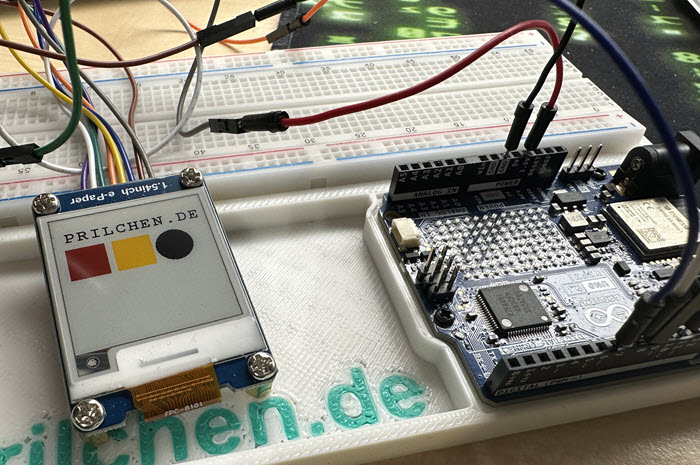

# Waveshare 1.54" e-Paper (G) 4-Color on Arduino R4 WiFi

Dieses Repository enthält den Beispielcode und die Konfiguration für den Betrieb des **Waveshare 1,54 Zoll e-Paper Moduls (G)** in der **Revision 2.1**. Das Besondere an diesem Modul ist die Darstellung von vier Farben: **Schwarz, Weiß, Rot und Gelb**.

Als Controller kommt der **Arduino R4 WiFi** (Renesas RA4M1 Architektur) zum Einsatz. Die Entwicklung erfolgt in **Visual Studio Code (VS Code)** mit der Erweiterung **PlatformIO (PIO)**.



## 🚀 Die Anforderung

Der Betrieb dieses speziellen Displays am Arduino R4 WiFi bringt zwei technische Besonderheiten mit sich, die in diesem Code gelöst sind:

1. **Auflösungs-Mapping:** Obwohl das Panel physisch 152x152 Pixel groß ist, erwartet der verbaute Controller eine Adressierung von **200x200 Pixeln**.
2. **Farbtiefe (2-Bit):** Im Gegensatz zu herkömmlichen Schwarz-Weiß-Displays (1-Bit) benötigt dieses Modell 2 Bits pro Pixel, um vier Farben darzustellen. Dies erfordert eine spezielle Pufferberechnung und die Nutzung der `Paint_SetScale(4)` Funktion.

## 🛠 Hardware-Anforderungen

* **Mikrocontroller:** Arduino R4 WiFi
* **Display:** Waveshare 1.54inch e-Paper Module (G) - Rev 2.1
* **Verbindung:** SPI (Serial Peripheral Interface – Serielle Peripherieschnittstelle)

### Pinbelegung (Pinout)

| Display-Pin | Arduino R4 WiFi | Beschreibung |
| --- | --- | --- |
| **VCC** | 5V | Stromversorgung (Dank Rev 2.1 inkl. Spannungsregler) |
| **GND** | GND | Masse |
| **DIN** | D11 (COPI) | Controller Out Peripheral In (Datenleitung) |
| **CLK** | D13 (SCK) | Serial Clock (Taktleitung) |
| **CS** | D10 | Chip Select (Aktivierung des Displays) |
| **DC** | D9 | Data / Command (Unterscheidung Daten/Befehl) |
| **RST** | D8 | Reset (Hardware-Neustart) |
| **BUSY** | D7 | Rückmeldung des Displays bei Aktivität |

## 💻 Software-Setup

Das Projekt ist für **PlatformIO** vorkonfiguriert.

1. Repository klonen oder herunterladen.
2. Ordner in VS Code öffnen.
3. Die Treiber-Dateien (`DEV_Config`, `EPD_1in54g`, `GUI_Paint`, `fonts`) müssen im Ordner `lib/Waveshare_Driver/` liegen.
4. Über das PlatformIO-Menü: **Clean** und anschließend **Upload**.

### Wichtige Einstellungen in der `platformio.ini`

```ini
[env:uno_r4_wifi]
platform = renesas-ra
board = uno_r4_wifi
framework = arduino
monitor_speed = 115200

```

## 🎓 Learning: Zahlen, Daten, Fakten

* **Bistabil:** Das Display benötigt nur Strom, wenn sich der Bildinhalt ändert. Danach bleibt das Bild ohne Energieversorgung erhalten.
* **Refresh-Zeit:** Aufgrund der physikalischen Trägheit der roten und gelben Pigmente dauert ein vollständiger Bildaufbau ca. **15-20 Sekunden**.
* **Pegelwandler:** Die Revision 2.1 besitzt einen integrierten **Level Shifter** (Pegelwandler), der die 5V-Signale des Arduino R4 sicher für das 3,3V-Display konvertiert.
* **RAM-Management:** Der Arduino R4 WiFi bietet mit 32 KB **SRAM** (Static Random Access Memory) genug Platz für den benötigten 10.000 Byte (ca. 9,8 KB) großen Bildpuffer. Ein klassischer Arduino Uno (2 KB) wäre hierfür nicht ausreichend.

---

Betrieben von 🌐 [prilchen.de](https://prilchen.de)

📺 [YouTube @prilchen](https://www.youtube.com/@prilchen)

🐙 [GitHub @prilchen](https://github.com/prilchen)

